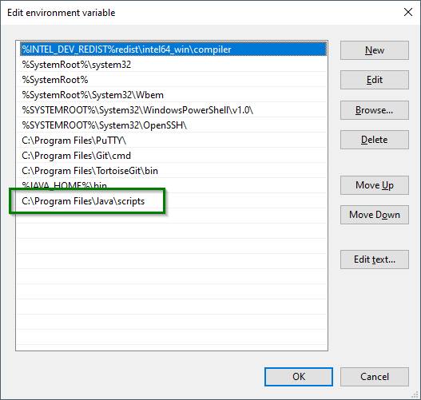
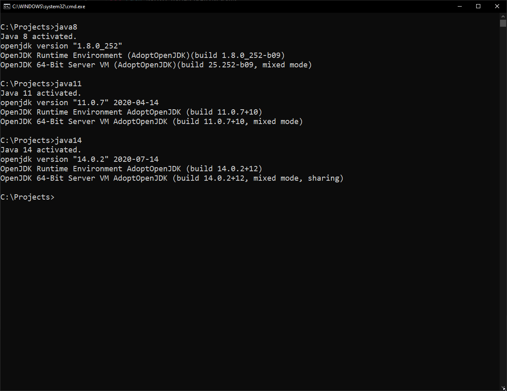

# Java Version Scripts Changer
### Scripts that help change version of Java on a Windows machines

 1. Clone the project
 2. Add the folder of the project scripts to PATH under "System Environment Variables" 
 3. Close all current terminals/folders for the change to take effect
 4. Open CMD, and do like the examples in the image
 
   
   
 ###IMPORTANT NOTE!  
 The scripts are pointing to the default installation dir of the AdoptOpenJDK version of Java JDK.  
 For any other version of JDKs - point the scripts to the right folders.